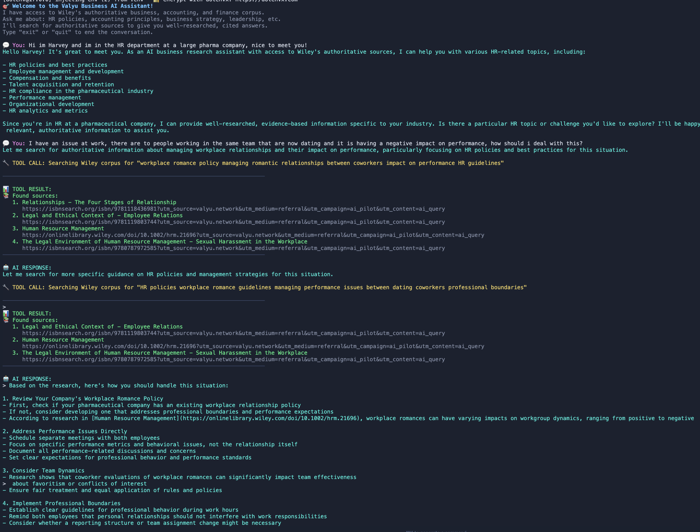

# Valyu Business AI Assistant Demo

> **Demo Application**: This is a demonstration of Valyu's search capabilities combined with AI for business research. It showcases how to build authoritative, citation-backed AI assistants using academic sources.

An interactive AI assistant that demonstrates how to provide authoritative business insights by searching Wiley's academic corpus of business, accounting, and finance publications. Get well-researched, cited answers to your business questions.

## What This Demo Shows

- 🔍 **Authoritative Research**: How to access Wiley's peer-reviewed business, finance, and accounting publications
- 💬 **Interactive Chat**: Building conversational AI with search capabilities
- 📚 **Proper Citations**: Automatic source citation with academic links
- 🎯 **Smart Search**: Strategic tool usage - searching only when needed
- 🎨 **Clean Interface**: Color-coded terminal output for better UX

## Quick Demo Setup

### 1. Get API Keys

- **Valyu API Key**: Sign up at [valyu.network](https://platform.valyu.network) to get a free API key
- **Anthropic API Key**: Get one from [console.anthropic.com](https://console.anthropic.com)

### 2. Install Dependencies

```bash
pnpm install
# or
npm install
```

### 3. Set Environment Variables

Create a `.env` file:

```env
VALYU_API_KEY=your_valyu_api_key_here
ANTHROPIC_API_KEY=your_anthropic_api_key_here
```

### 4. Run the Demo

```bash
node agent.js
```

## Try These Demo Questions

Ask questions about:
- HR policies and management
- Accounting principles and practices  
- Business strategy and leadership
- Corporate governance
- Financial analysis and planning

**Example questions to test:**
- "How can pharma companies increase revenue?
- "I am in HR, there are some coworkers that have recently started dating and it has been effecting their work. How should I handle this?"
- "What are the key components of internal controls for financial reporting?"

Type `exit` or `quit` to end the conversation.

## Demo Flow

1. **Ask a Question**: The assistant determines if it needs to search for authoritative information
2. **Smart Search**: When needed, it searches Wiley's academic corpus for relevant sources
3. **Cited Response**: You get a comprehensive answer with proper academic citations
4. **Follow Up**: Continue the conversation with follow-up questions that maintain context

**Perfect for demonstrating to**: researchers, business students, professionals, and anyone interested in AI-powered research tools.

## What it looks like


---
